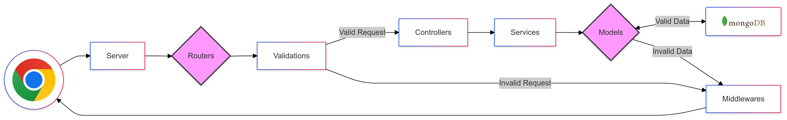

### TaskPro API

This repository houses the backend API for **TaskPro**.

## Key Features

-   **RESTful Architecture:** Follows best practices to ensure scalability, maintainability, and ease of use.

## Tech Stack

-   **MongoDB (v6.x):** The NoSQL database used for storing application data.
-   **MongoDB Node.js Driver:** Facilitates interaction with the MongoDB database.
-   **Express.js:** Provides a robust and minimalist web framework for Node.js.
-   **Joi:** Enables schema-based validation for incoming requests.

## Development Tools

-   **Babel:** Allows the use of modern JavaScript (ES6+) features.
-   **ESLint:** Maintains code quality and consistency.

## API Structure

   

-   **Middlewares:** Handle common functionalities like error handling.
-   **Routers:** Define API endpoints and their corresponding handlers.
-   **Validations:** Ensure data integrity by validating request data.
-   **Controllers:** Handle incoming requests.
-   **Services:** Encapsulate logic and data access operations.
-   **Models:** Define function to interact with the database.

## Getting Started

1.  **Node.js:** Ensure you have Node.js version 18.x or higher installed.
2.  Clone the repository: `git clone https://github.com/toanthienla/taskpro-api.git`
3.  Install dependencies: `npm install`
4.  Configure environment variables (database connection, etc.).
5.  Start the API server: `npm start`

## Contributing

Contributions are welcome! Feel free to submit issues and pull requests.
