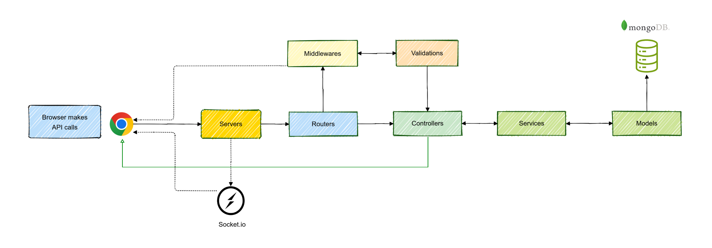
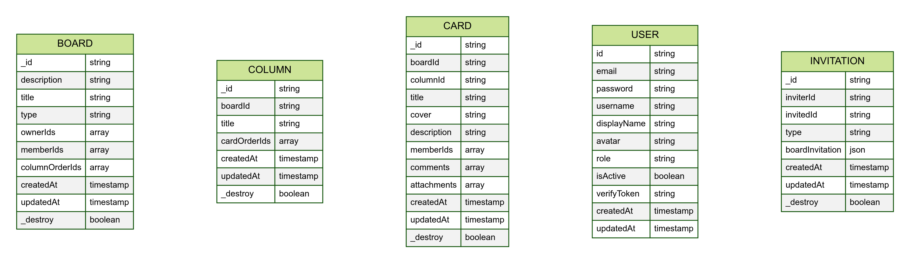

# TaskPro API

TaskPro API is a powerful Node.js/Express REST API that serves as the backend for the TaskPro application. Built with modern MongoDB for data persistence, it provides a robust foundation for task management functionality.

## System Architecture

### REST API Design with MVC

  

### Entity Relationship Diagram (ERD)

  

## Tech Stack

-   **Runtime**: Node.js
-   **Framework**: Express.js
-   **Database**: MongoDB
-   **Validation**: Joi
-   **Real-time**: Socket.IO
-   **File Storag**e: Cloudinary
-   **Email Service**: Brevo
-   **Authentication**: JWT

## Development Tools

-   **Babel:** Allows the use of modern JavaScript (ES6+) features.
-   **ESLint:** Maintains code quality and consistency.

## Project Structure

-   **`~/routes`**: API routes definition and mapping.
-   **`~/validations`**: Input validation schemas and logic.
-   **`~/controllers`**: Request handlers and API logic.
-   **`~/services`**: Business logic and data processing.
-   **`~/models`**: Database models and data structures.
-   **`~/middlewares`**: Request handling, auth, and error middleware.
-   **`~/providers`**: Integration with external services (e.g., Cloudinary, Brevo).
-   **`~/sockets`**: Socket.IO real-time communication handlers.
-   **`~/config`**: Application configuration and settings.
-   **`~/utils`**: Utility functions and constants.

## Getting Started

1.  **Node.js:** Ensure you have Node.js version 18.x or higher installed.
2.  Clone the repository: `git clone https://github.com/toanthienla/taskpro-api.git`
3.  Install dependencies: `npm install`
4.  Configure environment variables (database connection, etc.).
5.  Start the API development server: `npm run dev`

## Contributing

Contributions are welcome! Feel free to submit issues and pull requests.
